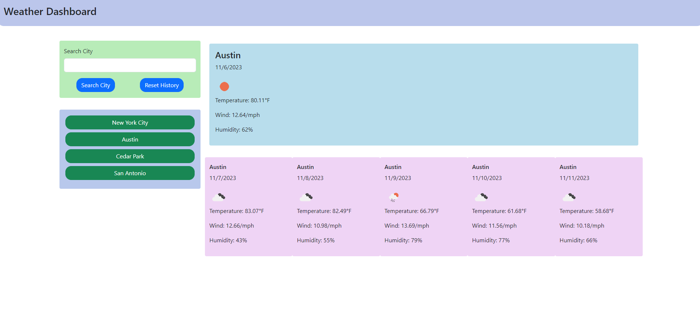

# angelo-weather-dashboard
Module 6 Challenge for UT Full-Stack Bootcamp

## Main Objective
This web application provides a quick and easy visual guide to the current and upcoming weather forecasts at a specified city. A user is able to tell the temperature, weather condition, humidity, and wind speed of a city they search.

## Website
[Github Link](https://whatnameshouldiuse.github.io/angelo-weather-dashboard/)

